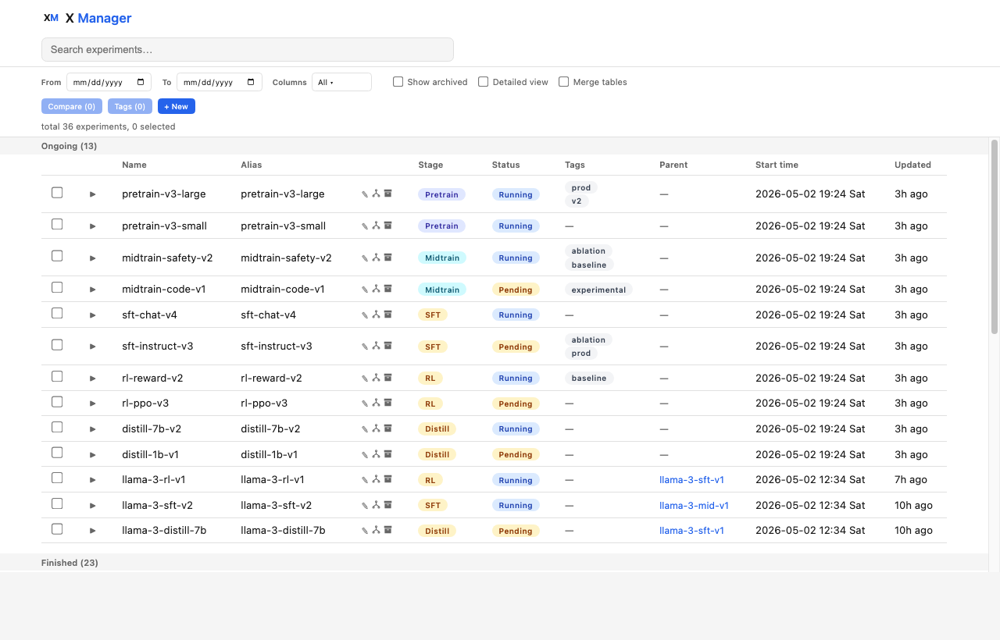
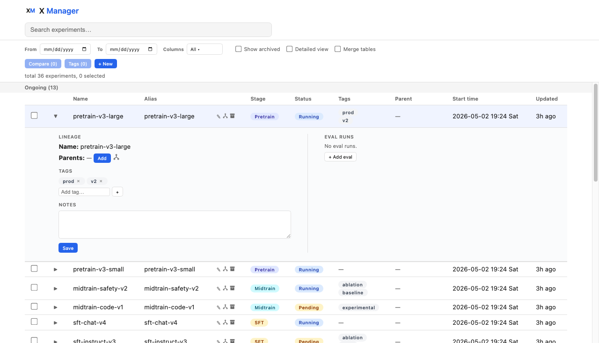
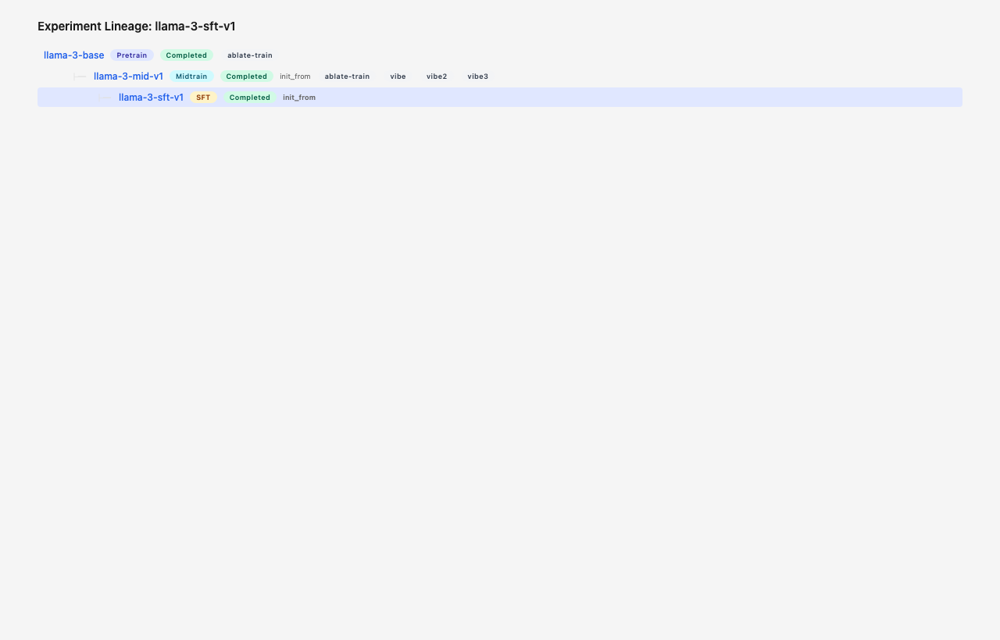

# X Manager

A lightweight web app for managing LLM training and eval workflows across the full pipeline: pretrain, midtrain, SFT, RL, and distill.

## Setup

```bash
python3 -m venv .venv
source .venv/bin/activate
pip install -e .
flask --app app init-db
flask --app app seed       # seeds the 5 default stages
python seed.py             # optional: adds sample experiments
flask --app app run --debug --port 5001
```

Open http://localhost:5001

## Screenshots

### Dashboard



### Experiment details



### Lineage tree



## Features

- Expandable experiment rows with inline parent lineage, eval runs, and notes
- Checkbox multi-select and wandb compare link generation
- Customizable visible columns
- Filter by stage, status, or search text
- Full REST API for programmatic access

## Stages

The following stages are seeded by default (IDs are stable):

| ID | Name     | Category  |
|----|----------|-----------|
| 1  | pretrain | pretrain  |
| 2  | midtrain | midtrain  |
| 3  | sft      | posttrain |
| 4  | rl       | posttrain |
| 5  | distill  | posttrain |

## CLI (`xm`)

The `xm` script wraps all API endpoints. Set `XM_BASE_URL` to override the default `http://localhost:5001`.

### Stages

```bash
xm stages
```

### Experiments

```bash
# List experiments (with optional filters)
xm ls
xm ls --stage sft --status running --search llama
xm ls --archived   # include archived experiments

# Get experiment detail (JSON with parents, children, eval runs)
xm get 1

# Create an experiment
xm create llama-4-sft-v1 --stage sft --status running \
  --wandb-entity my-team --wandb-project llm-sft --wandb-run-id abc123 \
  --notes "First SFT run on llama-4"

# Create with alias and tags
xm create llama-4-sft-v1 --stage sft --alias sft-v1 --tags "v1,baseline"

# Bulk create (JSON array from stdin)
echo '[
  {"name": "llama-4-base", "stage_id": 1, "status": "completed"},
  {"name": "llama-4-mid", "stage_id": 2, "status": "completed"},
  {"name": "llama-4-sft-v1", "stage_id": 3, "status": "running"}
]' | xm bulk-create

# Update (partial — only send fields you want to change)
xm update 1 --status completed --notes "Done training, evals look good"

# Clear a field by passing the flag with no value
xm update 1 --alias

# Archive / unarchive
xm archive 1
xm unarchive 1
```

### Lineage (parent relationships)

```bash
# Add a parent (experiment 3 inits from experiment 2)
xm add-parent 3 2
xm add-parent 3 2 --relation distill_from

# Remove a parent relationship
xm rm-parent 3 2
```

Supported relation types: `init_from`, `distill_from`.

### Eval runs

```bash
# List eval runs for an experiment
xm evals 3

# Add an eval run
xm add-eval 3 mmlu --status completed --metrics '{"accuracy": 0.85, "5-shot": 0.82}' \
  --wandb-entity my-team --wandb-project llm-evals --wandb-run-id eval-001

# Bulk create evals (JSON array from stdin)
echo '[
  {"name": "mmlu", "status": "completed", "metrics": {"accuracy": 0.85}},
  {"name": "humaneval", "status": "completed", "metrics": {"pass@1": 0.72}},
  {"name": "gsm8k", "status": "running"}
]' | xm bulk-evals 3

# Update an eval run
xm update-eval 1 --status completed --metrics '{"accuracy": 0.87}'

# Delete an eval run
xm rm-eval 1
```

### Tags

```bash
# List all tags
xm tags

# Add a tag to a single experiment
xm tag 1 baseline

# Remove a tag from a single experiment (by tag ID)
xm untag 1 3

# Bulk add a tag to multiple experiments
xm bulk-tag v2 --ids 1,2,3

# Bulk remove a tag from multiple experiments
xm bulk-untag v2 --ids 1,2,3
```

### Compare (wandb)

```bash
# Generate wandb comparison URLs
xm compare --ids 1,2,3
```

### Statuses

`pending`, `running`, `stopped`, `completed`, `failed`, `cancelled`

## Example: populate a full pipeline

```bash
# Create experiments
xm create llama-4-base --stage pretrain --status completed
xm create llama-4-mid --stage midtrain --status completed
xm create llama-4-sft-v1 --stage sft --status running \
  --wandb-entity my-team --wandb-project sft --wandb-run-id run-sft-1

# Link lineage (use IDs from create output)
xm add-parent 2 1
xm add-parent 3 2

# Add evals
echo '[
  {"name": "mmlu", "status": "completed", "metrics": {"accuracy": 0.85}},
  {"name": "gsm8k", "status": "running"}
]' | xm bulk-evals 3
```

## Data Model

### Stage

| Field        | Type    | Description                                      |
|--------------|---------|--------------------------------------------------|
| id           | int     | Auto-increment primary key                       |
| name         | string  | Unique stage name (e.g. `pretrain`, `sft`)       |
| category     | string  | One of `pretrain`, `midtrain`, `posttrain`       |
| sort_order   | int     | Display ordering (default 0)                     |

### Experiment

| Field         | Type    | Description                                          |
|---------------|---------|------------------------------------------------------|
| id            | int     | Auto-increment primary key                           |
| name          | string  | Experiment name (required)                           |
| alias         | string? | Optional unique alias                                |
| stage_id      | int     | FK → `stage.id` (required)                           |
| status        | string  | One of `pending`, `running`, `stopped`, `completed`, `failed`, `cancelled` |
| wandb_entity  | string? | W&B entity (team/user)                               |
| wandb_project | string? | W&B project name                                     |
| wandb_run_id  | string? | W&B run ID                                           |
| config_json   | string? | Arbitrary JSON config blob                           |
| notes         | string  | Free-text notes (default `""`)                       |
| archived      | int     | 0 = active, 1 = archived (hidden by default)        |
| created_at    | string  | ISO datetime, set on creation                        |
| updated_at    | string  | ISO datetime, updated on every write                 |

### Experiment Lineage

Join table expressing directed parent → child relationships between experiments (DAG).

| Field     | Type   | Description                                    |
|-----------|--------|------------------------------------------------|
| parent_id | int    | FK → `experiment.id`                           |
| child_id  | int    | FK → `experiment.id`                           |
| relation  | string | One of `init_from`, `distill_from` (default `init_from`) |

Composite PK `(parent_id, child_id)`. Self-references are disallowed.

### Eval Run

| Field         | Type    | Description                                |
|---------------|---------|--------------------------------------------|
| id            | int     | Auto-increment primary key                 |
| experiment_id | int     | FK → `experiment.id` (cascade delete)      |
| name          | string  | Eval benchmark name (e.g. `mmlu`, `gsm8k`) |
| status        | string  | Same status values as experiment           |
| wandb_entity  | string? | W&B entity                                 |
| wandb_project | string? | W&B project                                |
| wandb_run_id  | string? | W&B run ID                                 |
| metrics_json  | string? | JSON object of metric key-value pairs      |
| created_at    | string  | ISO datetime                               |
| updated_at    | string  | ISO datetime                               |

### Tag

| Field | Type   | Description                |
|-------|--------|----------------------------|
| id    | int    | Auto-increment primary key |
| name  | string | Unique tag name            |

### Experiment Tag

Many-to-many join table between experiments and tags.

| Field         | Type | Description               |
|---------------|------|---------------------------|
| experiment_id | int  | FK → `experiment.id`      |
| tag_id        | int  | FK → `tag.id`             |

Composite PK `(experiment_id, tag_id)`. Both sides cascade on delete.

## Tech stack

- Python / Flask / SQLite
- Vanilla HTML + JS + CSS (no build step)
